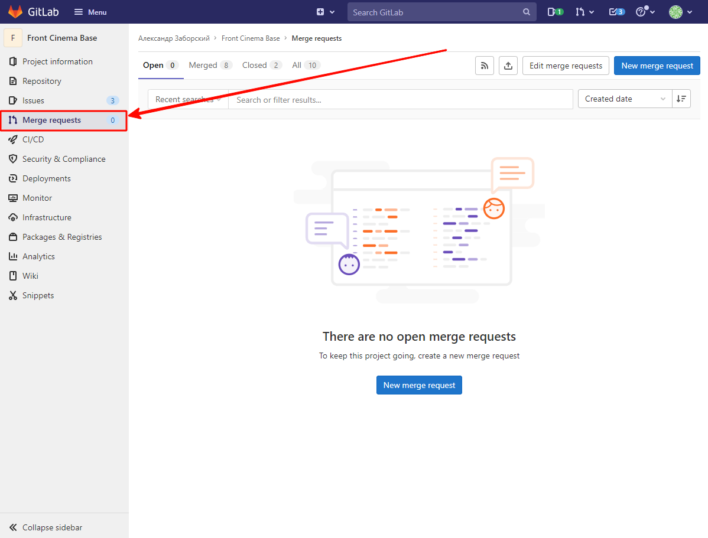
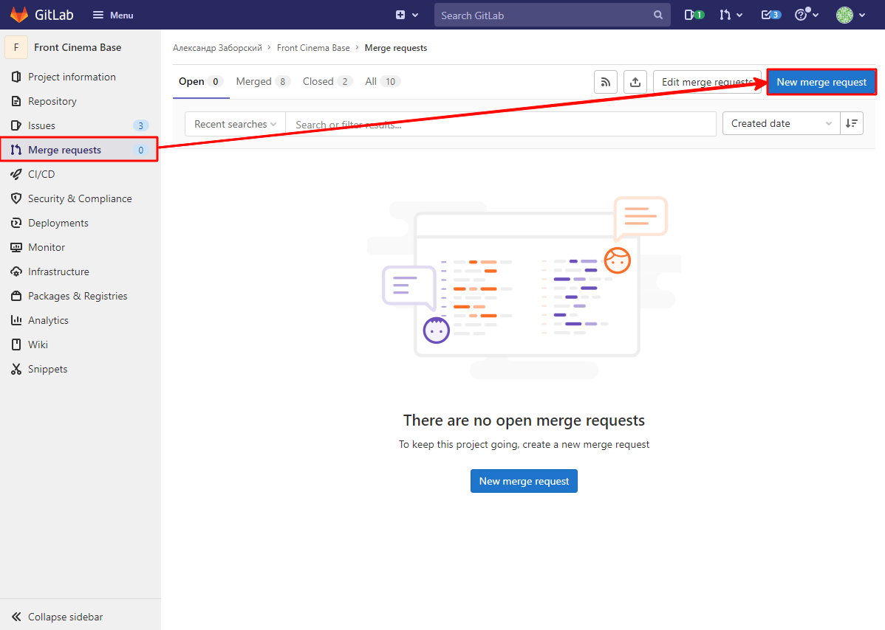
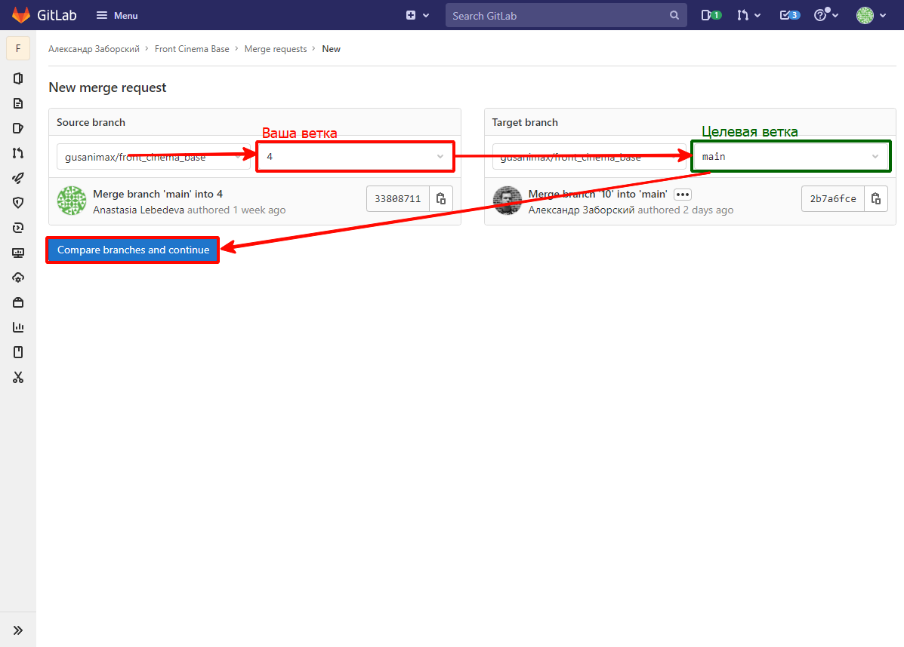
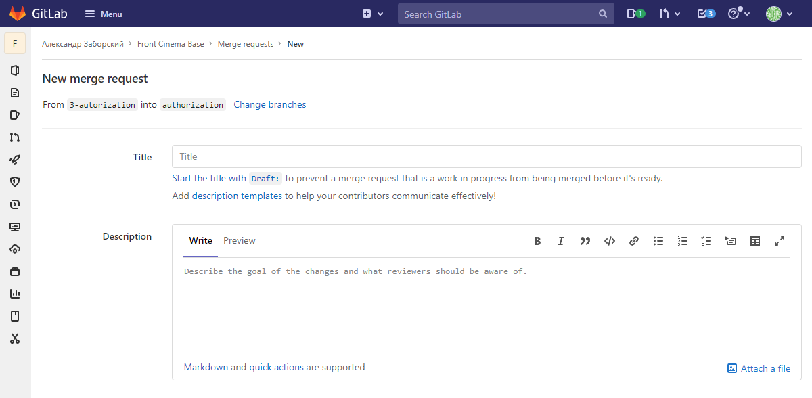
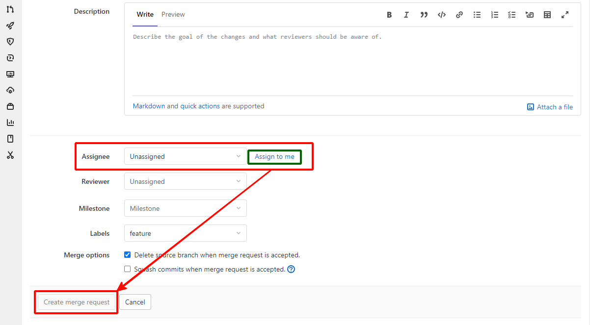

https://todos-j92miil1l-yfcmrbyc.vercel.app/

### Front cinema base

Для разработки проекта используется следующий стек:
* Typescript
* React
* React Router DOM
* Redux
* Redux Thunk

#### Как сделать merge request:
После того как выполнили команду _git push_ в локальной среде, открываем _GitLab_ и переходим во вкладку _Merge Requests_

Далее в правом верхнем углу нажимаем на кнопку _New merge mequest_

На следующей странице необходимо будет выбрать исходную ветку (вашу, слева), целевую векту, в которую будут вливаться изменения (справа) и нажать на кнопку _Compare branches and continue_

На следующей странице можно заполнить заголовок и описание 

В качестве проверяющего (_Assignee_) выбираем себя и создаем _merge request_ - кнопка _Create merge request_

